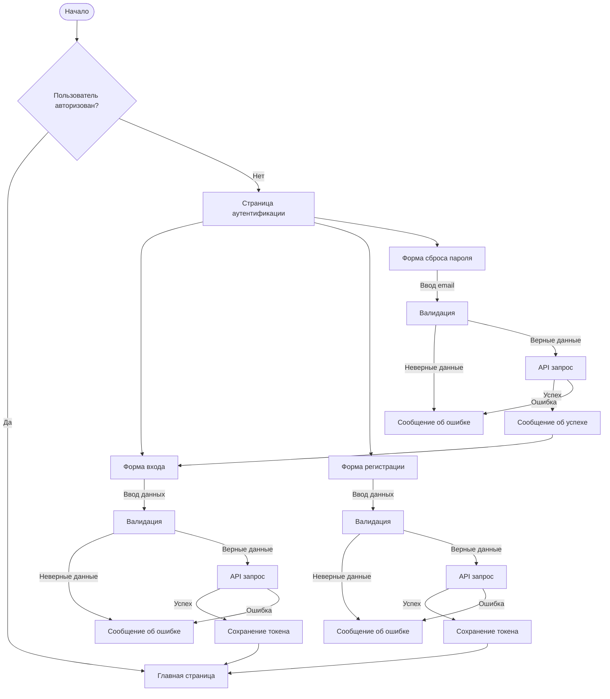
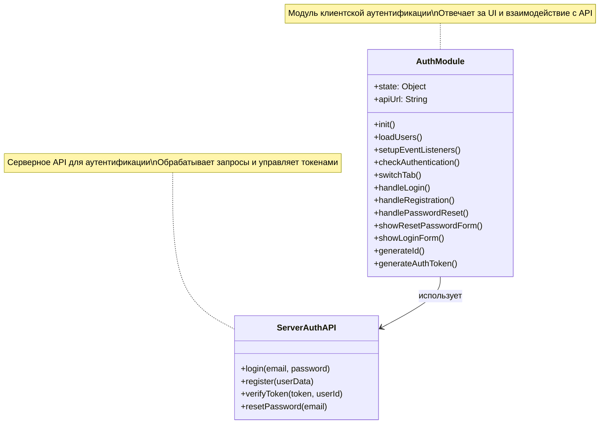

# Модуль аутентификации

## Процесс аутентификации

```mermaid
flowchart TD
    Start([Начало]) --> Login{Пользователь авторизован?}
    Login -->|Да| Main[Главная страница]
    Login -->|Нет| Auth[Страница аутентификации]
    
    Auth --> LoginForm[Форма входа]
    Auth --> RegisterForm[Форма регистрации]
    Auth --> ResetForm[Форма сброса пароля]
    
    LoginForm -->|Ввод данных| ValidateLogin[Валидация]
    ValidateLogin -->|Неверные данные| LoginError[Сообщение об ошибке]
    ValidateLogin -->|Верные данные| ApiLogin[API запрос]
    ApiLogin -->|Успех| SaveToken[Сохранение токена]
    ApiLogin -->|Ошибка| LoginError
    SaveToken --> Main
    
    RegisterForm -->|Ввод данных| ValidateRegister[Валидация]
    ValidateRegister -->|Неверные данные| RegisterError[Сообщение об ошибке]
    ValidateRegister -->|Верные данные| ApiRegister[API запрос]
    ApiRegister -->|Успех| SaveTokenReg[Сохранение токена]
    ApiRegister -->|Ошибка| RegisterError
    SaveTokenReg --> Main
    
    ResetForm -->|Ввод email| ValidateReset[Валидация]
    ValidateReset -->|Неверные данные| ResetError[Сообщение об ошибке]
    ValidateReset -->|Верные данные| ApiReset[API запрос]
    ApiReset -->|Успех| ResetSuccess[Сообщение об успехе]
    ApiReset -->|Ошибка| ResetError
    ResetSuccess --> LoginForm
    
    class Main,SaveToken,SaveTokenReg success
    class LoginError,RegisterError,ResetError error
```

## Архитектура модуля аутентификации

```mermaid
classDiagram
    class AuthModule {
        +state: Object
        +apiUrl: String
        +init()
        +loadUsers()
        +setupEventListeners()
        +checkAuthentication()
        +switchTab()
        +handleLogin()
        +handleRegistration()
        +handlePasswordReset()
        +showResetPasswordForm()
        +showLoginForm()
        +generateId()
        +generateAuthToken()
    }
    
    class ServerAuthAPI {
        +login(email, password)
        +register(userData)
        +verifyToken(token, userId)
        +resetPassword(email)
    }
    
    AuthModule --> ServerAuthAPI : использует
    
    note for AuthModule "Модуль клиентской аутентификации\nОтвечает за UI и взаимодействие с API"
    note for ServerAuthAPI "Серверное API для аутентификации\nОбрабатывает запросы и управляет токенами"
```
