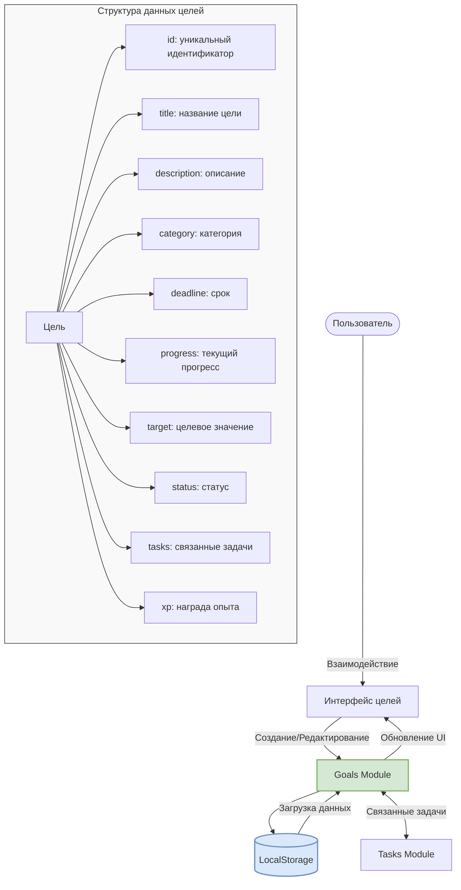
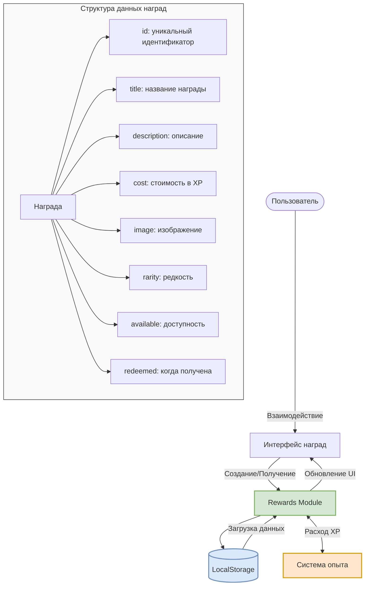
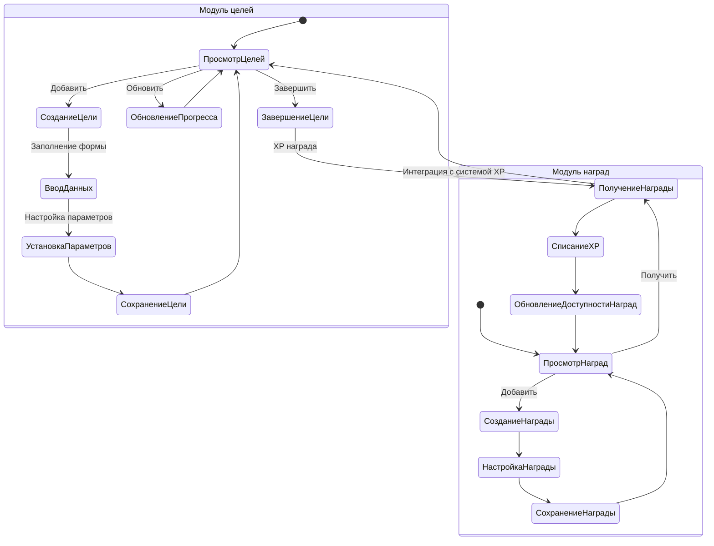
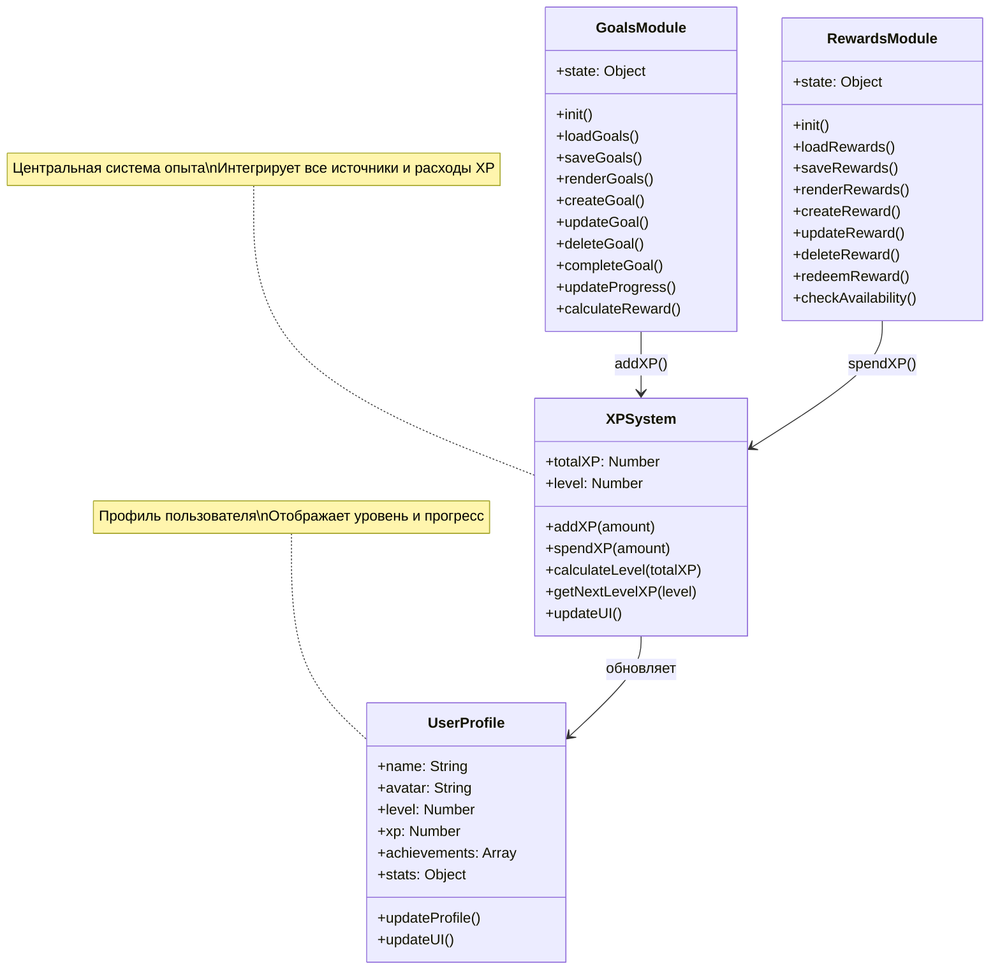

# Модули целей и наград

## Структура модуля целей

```mermaid
flowchart TD
    User([Пользователь]) -->|Взаимодействие| GoalsUI[Интерфейс целей]
    GoalsUI -->|Создание/Редактирование| GoalsModule[Goals Module]
    
    subgraph goalsData [Структура данных целей]
        Goal[Цель] --> Id[id: уникальный идентификатор]
        Goal --> Title[title: название цели]
        Goal --> Desc[description: описание]
        Goal --> Category[category: категория]
        Goal --> Deadline[deadline: срок]
        Goal --> Progress[progress: текущий прогресс]
        Goal --> Target[target: целевое значение]
        Goal --> Status[status: статус]
        Goal --> Tasks[tasks: связанные задачи]
        Goal --> XP[xp: награда опыта]
    end
    
    GoalsModule --> LocalStorage[(LocalStorage)]
    LocalStorage -->|Загрузка данных| GoalsModule
    GoalsModule -->|Обновление UI| GoalsUI
    GoalsModule <-->|Связанные задачи| TasksModule[Tasks Module]
    
    style goalsData fill:#f9f9f9,stroke:#333,stroke-width:1px
    style GoalsModule fill:#d5e8d4,stroke:#82b366,stroke-width:2px
    style LocalStorage fill:#dae8fc,stroke:#6c8ebf,stroke-width:2px
```

## Структура модуля наград

```mermaid
flowchart TD
    User([Пользователь]) -->|Взаимодействие| RewardsUI[Интерфейс наград]
    RewardsUI -->|Создание/Получение| RewardsModule[Rewards Module]
    
    subgraph rewardsData [Структура данных наград]
        Reward[Награда] --> Id[id: уникальный идентификатор]
        Reward --> Title[title: название награды]
        Reward --> Desc[description: описание]
        Reward --> Cost[cost: стоимость в XP]
        Reward --> Image[image: изображение]
        Reward --> Rarity[rarity: редкость]
        Reward --> Available[available: доступность]
        Reward --> Redeemed[redeemed: когда получена]
    end
    
    RewardsModule --> LocalStorage[(LocalStorage)]
    LocalStorage -->|Загрузка данных| RewardsModule
    RewardsModule -->|Обновление UI| RewardsUI
    RewardsModule <-->|Расход XP| XPSystem[Система опыта]
    
    style rewardsData fill:#f9f9f9,stroke:#333,stroke-width:1px
    style RewardsModule fill:#d5e8d4,stroke:#82b366,stroke-width:2px
    style LocalStorage fill:#dae8fc,stroke:#6c8ebf,stroke-width:2px
    style XPSystem fill:#ffe6cc,stroke:#d79b00,stroke-width:2px
```

## Процесс управления целями и наградами

```mermaid
stateDiagram-v2
    state "Модуль целей" as Goals {
        [*] --> ПросмотрЦелей
        ПросмотрЦелей --> СозданиеЦели: Добавить
        СозданиеЦели --> ВводДанных: Заполнение формы
        ВводДанных --> УстановкаПараметров: Настройка параметров
        УстановкаПараметров --> СохранениеЦели
        СохранениеЦели --> ПросмотрЦелей
        
        ПросмотрЦелей --> ОбновлениеПрогресса: Обновить
        ОбновлениеПрогресса --> ПросмотрЦелей
        
        ПросмотрЦелей --> ЗавершениеЦели: Завершить
        ЗавершениеЦели --> ПолучениеНаграды: XP награда
        ПолучениеНаграды --> ПросмотрЦелей
    }
    
    state "Модуль наград" as Rewards {
        [*] --> ПросмотрНаград
        ПросмотрНаград --> СозданиеНаграды: Добавить
        СозданиеНаграды --> НастройкаНаграды
        НастройкаНаграды --> СохранениеНаграды
        СохранениеНаграды --> ПросмотрНаград
        
        ПросмотрНаград --> ПолучениеНаграды: Получить
        ПолучениеНаграды --> СписаниеXP
        СписаниеXP --> ОбновлениеДоступностиНаград
        ОбновлениеДоступностиНаград --> ПросмотрНаград
    }
    
    Goals --> Rewards: Интеграция с системой XP
```

## Интеграция систем опыта и прогресса

```mermaid
classDiagram
    class GoalsModule {
        +state: Object
        +init()
        +loadGoals()
        +saveGoals()
        +renderGoals()
        +createGoal()
        +updateGoal()
        +deleteGoal()
        +completeGoal()
        +updateProgress()
        +calculateReward()
    }
    
    class RewardsModule {
        +state: Object
        +init()
        +loadRewards()
        +saveRewards()
        +renderRewards()
        +createReward()
        +updateReward()
        +deleteReward()
        +redeemReward()
        +checkAvailability()
    }
    
    class XPSystem {
        +totalXP: Number
        +level: Number
        +addXP(amount)
        +spendXP(amount)
        +calculateLevel(totalXP)
        +getNextLevelXP(level)
        +updateUI()
    }
    
    class UserProfile {
        +name: String
        +avatar: String
        +level: Number
        +xp: Number
        +achievements: Array
        +stats: Object
        +updateProfile()
        +updateUI()
    }
    
    GoalsModule --> XPSystem : addXP()
    RewardsModule --> XPSystem : spendXP()
    XPSystem --> UserProfile : обновляет
    
    note for XPSystem "Центральная система опыта\nИнтегрирует все источники и расходы XP"
    note for UserProfile "Профиль пользователя\nОтображает уровень и прогресс"
```
