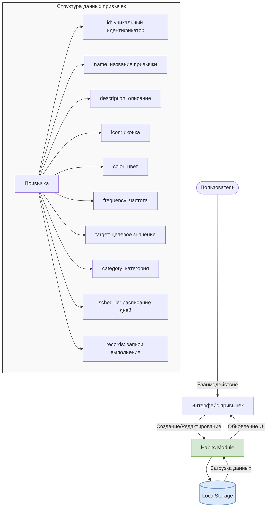
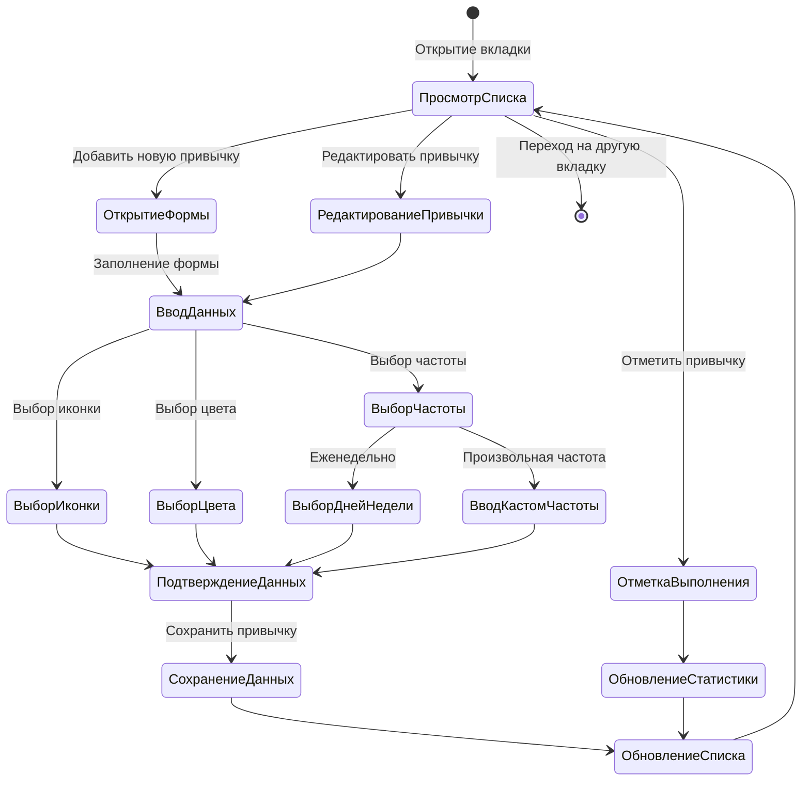
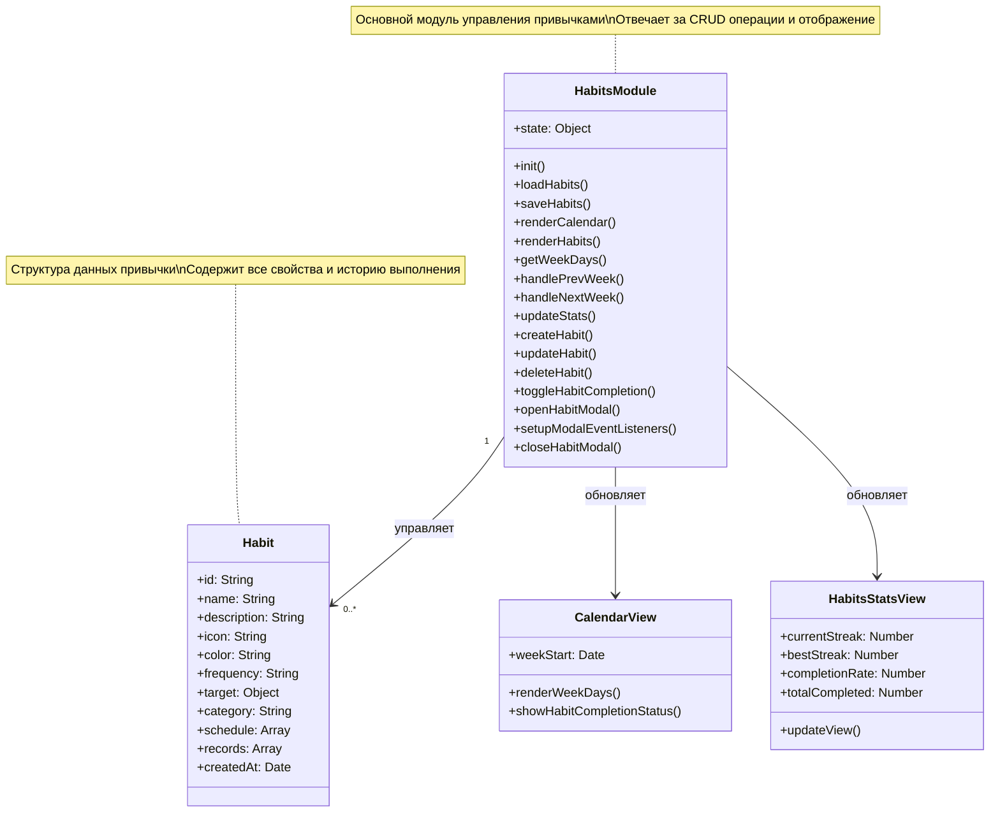

# Модуль привычек (Habits)

## Структура данных и поток информации

```mermaid
flowchart TD
    User([Пользователь]) -->|Взаимодействие| UI[Интерфейс привычек]
    UI -->|Создание/Редактирование| HabitsModule[Habits Module]
    
    subgraph habitsData [Структура данных привычек]
        Habit[Привычка] --> Id[id: уникальный идентификатор]
        Habit --> Name[name: название привычки]
        Habit --> Desc[description: описание]
        Habit --> Icon[icon: иконка]
        Habit --> Color[color: цвет]
        Habit --> Freq[frequency: частота]
        Habit --> Target[target: целевое значение]
        Habit --> Category[category: категория]
        Habit --> Schedule[schedule: расписание дней]
        Habit --> Records[records: записи выполнения]
    end
    
    HabitsModule --> LocalStorage[(LocalStorage)]
    LocalStorage -->|Загрузка данных| HabitsModule
    HabitsModule -->|Обновление UI| UI
    
    style habitsData fill:#f9f9f9,stroke:#333,stroke-width:1px
    style HabitsModule fill:#d5e8d4,stroke:#82b366,stroke-width:2px
    style LocalStorage fill:#dae8fc,stroke:#6c8ebf,stroke-width:2px
```

## Функциональный процесс работы с привычками

```mermaid
stateDiagram-v2
    [*] --> ПросмотрСписка: Открытие вкладки
    ПросмотрСписка --> ОткрытиеФормы: Добавить новую привычку
    ПросмотрСписка --> ОтметкаВыполнения: Отметить привычку
    ПросмотрСписка --> РедактированиеПривычки: Редактировать привычку
    
    ОткрытиеФормы --> ВводДанных: Заполнение формы
    ВводДанных --> ВыборИконки: Выбор иконки
    ВводДанных --> ВыборЦвета: Выбор цвета
    ВводДанных --> ВыборЧастоты: Выбор частоты
    ВыборЧастоты --> ВыборДнейНедели: Еженедельно
    ВыборЧастоты --> ВводКастомЧастоты: Произвольная частота
    
    ВыборИконки --> ПодтверждениеДанных
    ВыборЦвета --> ПодтверждениеДанных
    ВыборДнейНедели --> ПодтверждениеДанных
    ВводКастомЧастоты --> ПодтверждениеДанных
    
    ПодтверждениеДанных --> СохранениеДанных: Сохранить привычку
    СохранениеДанных --> ОбновлениеСписка
    РедактированиеПривычки --> ВводДанных
    ОтметкаВыполнения --> ОбновлениеСтатистики
    ОбновлениеСтатистики --> ОбновлениеСписка
    ОбновлениеСписка --> ПросмотрСписка
    
    ПросмотрСписка --> [*]: Переход на другую вкладку
```

## Архитектура модуля привычек

```mermaid
classDiagram
    class HabitsModule {
        +state: Object
        +init()
        +loadHabits()
        +saveHabits()
        +renderCalendar()
        +renderHabits()
        +getWeekDays()
        +handlePrevWeek()
        +handleNextWeek()
        +updateStats()
        +createHabit()
        +updateHabit()
        +deleteHabit()
        +toggleHabitCompletion()
        +openHabitModal()
        +setupModalEventListeners()
        +closeHabitModal()
    }
    
    class Habit {
        +id: String
        +name: String
        +description: String
        +icon: String
        +color: String
        +frequency: String
        +target: Object
        +category: String
        +schedule: Array
        +records: Array
        +createdAt: Date
    }
    
    class CalendarView {
        +weekStart: Date
        +renderWeekDays()
        +showHabitCompletionStatus()
    }
    
    class HabitsStatsView {
        +currentStreak: Number
        +bestStreak: Number
        +completionRate: Number
        +totalCompleted: Number
        +updateView()
    }
    
    HabitsModule "1" --> "0..*" Habit : управляет
    HabitsModule --> CalendarView : обновляет
    HabitsModule --> HabitsStatsView : обновляет
    
    note for HabitsModule "Основной модуль управления привычками\nОтвечает за CRUD операции и отображение"
    note for Habit "Структура данных привычки\nСодержит все свойства и историю выполнения"
```
