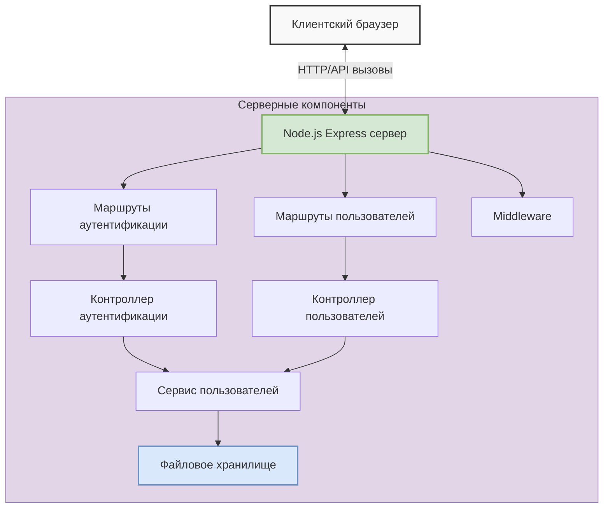
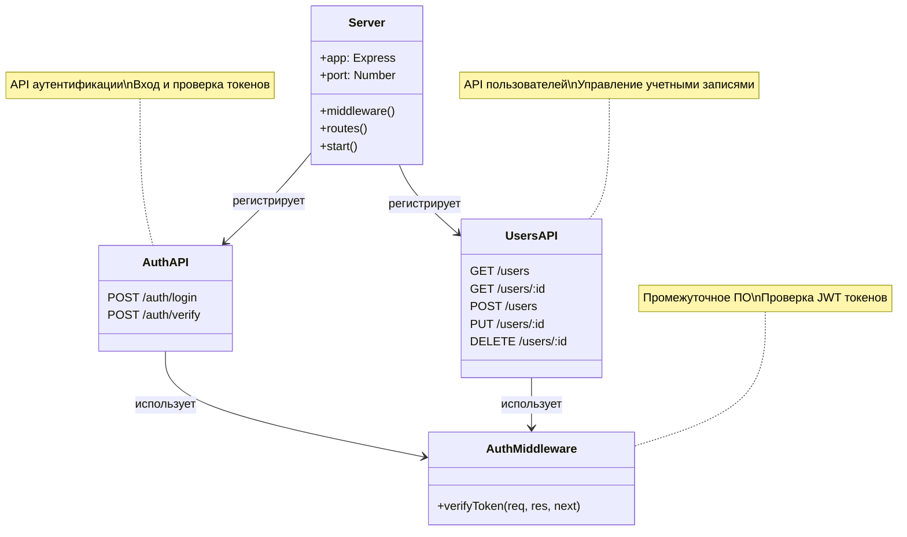
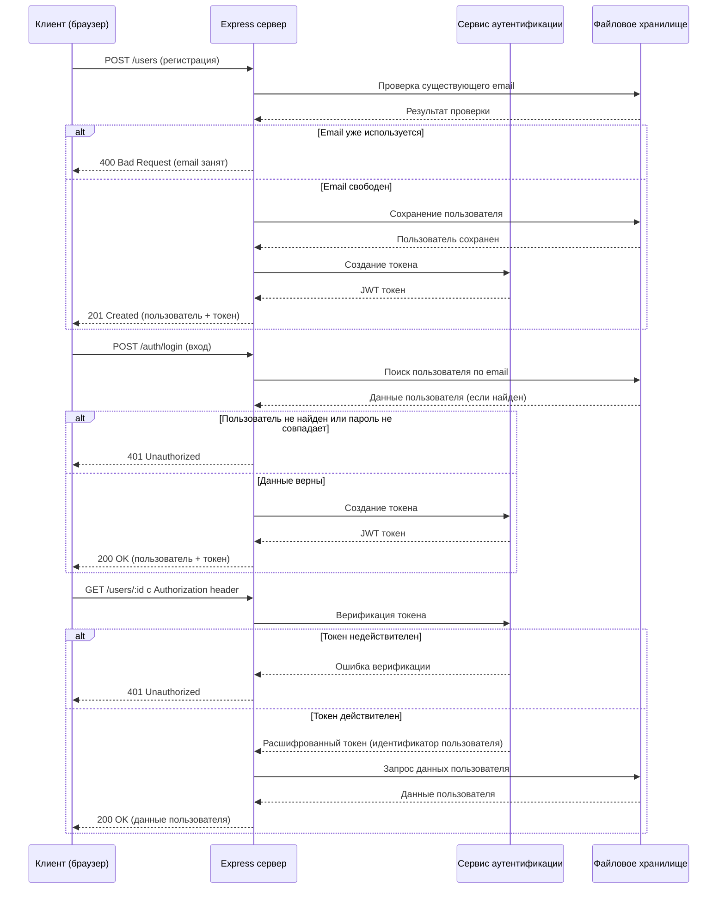

# Серверная часть и API

## Архитектура сервера

## Структура REST API

## Поток аутентификации и API запросов

## Структура конечных точек API

| Метод | URL | Описание | Параметры запроса | Ответ |
|-------|-----|----------|-----------------|------|
| POST | `/users` | Регистрация нового пользователя | `{name, email, password, avatar}` | `{user, token}` |
| POST | `/auth/login` | Вход пользователя | `{email, password}` | `{user, token}` |
| POST | `/auth/verify` | Проверка валидности токена | `{token, userId}` | `{valid: true/false}` |
| GET | `/users` | Получение списка пользователей | - | `[{user}, ...]` |
| GET | `/users/:id` | Получение данных пользователя | `id` (в URL) | `{user}` |
| PUT | `/users/:id` | Обновление данных пользователя | `id` (в URL), `{user data}` | `{user}` |
| DELETE | `/users/:id` | Удаление пользователя | `id` (в URL) | `{success: true}` |
