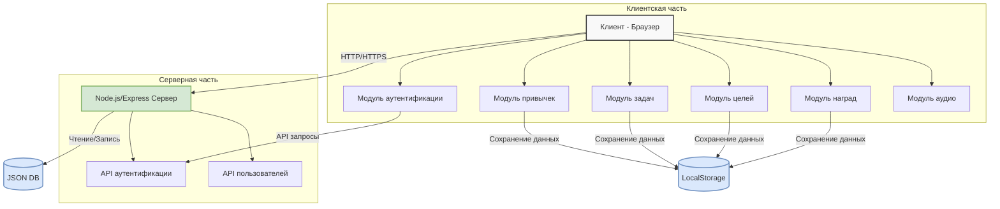
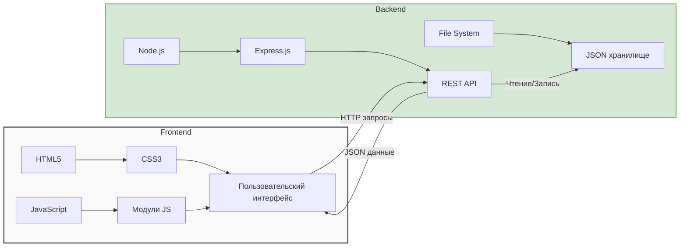
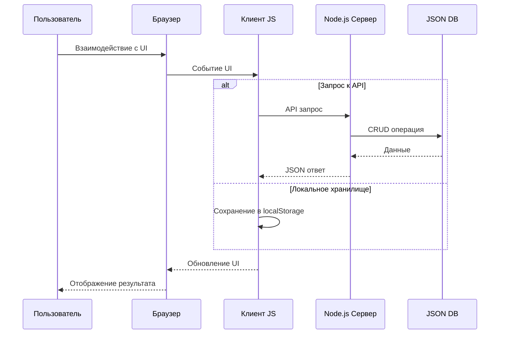

# Архитектура системы LifeQuest

## Общий обзор системы

```mermaid
graph TD
    Client[Клиент - Браузер] -->|HTTP/HTTPS| Server[Node.js/Express Сервер]
    Server -->|Чтение/Запись| DB[(JSON DB)]
    
    subgraph Клиентская часть
        Client --> AuthUI[Модуль аутентификации]
        Client --> HabitsUI[Модуль привычек]
        Client --> TasksUI[Модуль задач]
        Client --> GoalsUI[Модуль целей]
        Client --> RewardsUI[Модуль наград]
        Client --> AudioUI[Модуль аудио]
    end
    
    subgraph Серверная часть
        Server --> AuthAPI[API аутентификации]
        Server --> UsersAPI[API пользователей]
    end
    
    AuthUI -->|API запросы| AuthAPI
    HabitsUI -->|Сохранение данных| LocalStorage[(LocalStorage)]
    TasksUI -->|Сохранение данных| LocalStorage
    GoalsUI -->|Сохранение данных| LocalStorage
    RewardsUI -->|Сохранение данных| LocalStorage
    
    style Client fill:#f9f9f9,stroke:#333,stroke-width:2px
    style Server fill:#d5e8d4,stroke:#82b366,stroke-width:2px
    style DB fill:#dae8fc,stroke:#6c8ebf,stroke-width:2px
    style LocalStorage fill:#dae8fc,stroke:#6c8ebf,stroke-width:2px
```

## Технологический стек

```mermaid
flowchart LR
    subgraph Frontend
        HTML[HTML5] --> CSS[CSS3]
        CSS --> UI[Пользовательский интерфейс]
        JS[JavaScript] --> Modules[Модули JS]
        Modules --> UI
    end
    
    subgraph Backend
        Node[Node.js] --> Express[Express.js]
        Express --> API[REST API]
        FS[File System] --> Storage[JSON хранилище]
    end
    
    UI -->|HTTP запросы| API
    API -->|JSON данные| UI
    API -->|Чтение/Запись| Storage
    
    style Frontend fill:#f9f9f9,stroke:#333,stroke-width:2px
    style Backend fill:#d5e8d4,stroke:#82b366,stroke-width:2px
```

## Коммуникационная модель

```mermaid
sequenceDiagram
    participant Пользователь
    participant Браузер
    participant Клиент as Клиент JS
    participant Сервер as Node.js Сервер
    participant БД as JSON DB
    
    Пользователь->>Браузер: Взаимодействие с UI
    Браузер->>Клиент: Событие UI
    
    alt Запрос к API
        Клиент->>Сервер: API запрос
        Сервер->>БД: CRUD операция
        БД-->>Сервер: Данные
        Сервер-->>Клиент: JSON ответ
    else Локальное хранилище
        Клиент->>Клиент: Сохранение в localStorage
    end
    
    Клиент-->>Браузер: Обновление UI
    Браузер-->>Пользователь: Отображение результата
```
