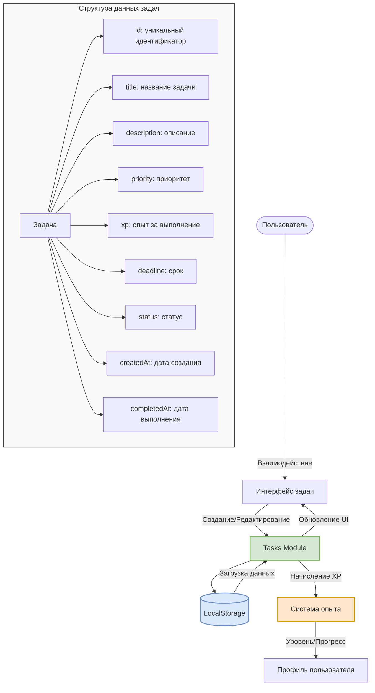
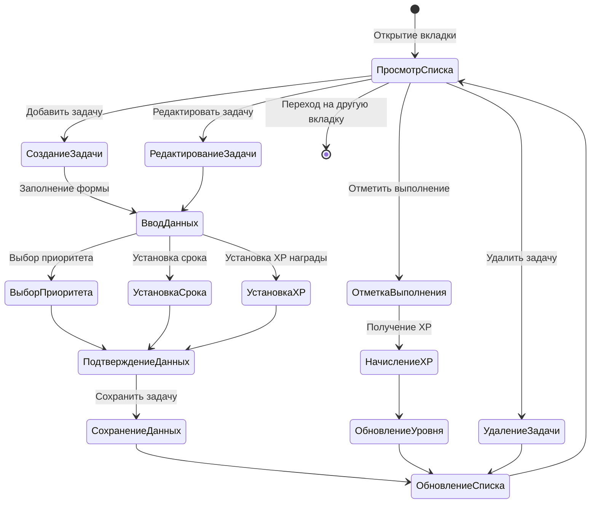
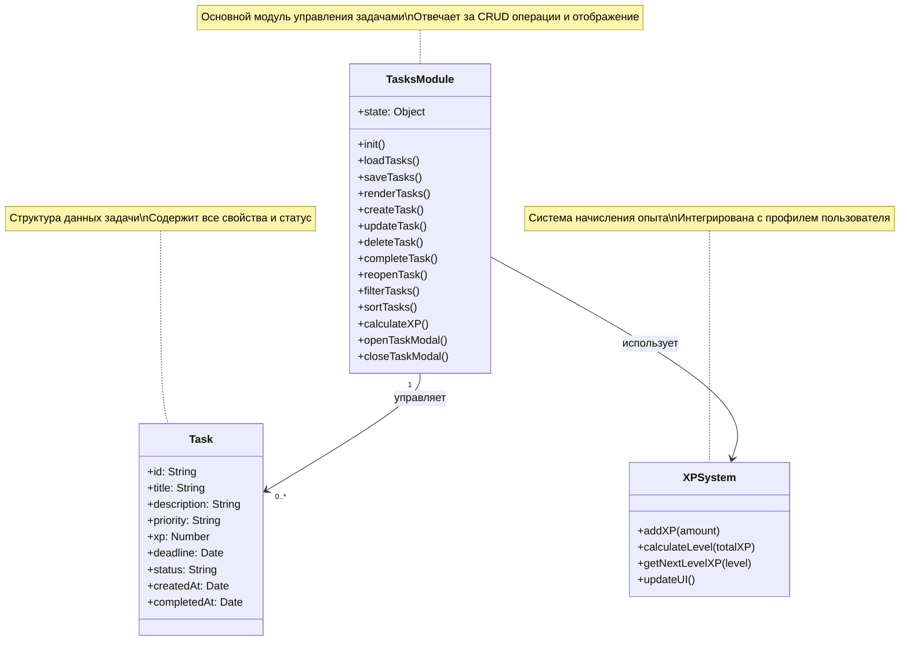

# Модуль задач (Tasks)

## Структура данных и взаимодействия

```mermaid
flowchart TD
    User([Пользователь]) -->|Взаимодействие| UI[Интерфейс задач]
    UI -->|Создание/Редактирование| TasksModule[Tasks Module]
    
    subgraph tasksData [Структура данных задач]
        Task[Задача] --> Id[id: уникальный идентификатор]
        Task --> Title[title: название задачи]
        Task --> Desc[description: описание]
        Task --> Priority[priority: приоритет]
        Task --> XP[xp: опыт за выполнение]
        Task --> DeadLine[deadline: срок]
        Task --> Status[status: статус]
        Task --> CreatedAt[createdAt: дата создания]
        Task --> CompletedAt[completedAt: дата выполнения]
    end
    
    TasksModule --> LocalStorage[(LocalStorage)]
    LocalStorage -->|Загрузка данных| TasksModule
    TasksModule -->|Обновление UI| UI
    TasksModule -->|Начисление XP| XPSystem[Система опыта]
    XPSystem -->|Уровень/Прогресс| ProfileModule[Профиль пользователя]
    
    style tasksData fill:#f9f9f9,stroke:#333,stroke-width:1px
    style TasksModule fill:#d5e8d4,stroke:#82b366,stroke-width:2px
    style LocalStorage fill:#dae8fc,stroke:#6c8ebf,stroke-width:2px
    style XPSystem fill:#ffe6cc,stroke:#d79b00,stroke-width:2px
```

## Процесс управления задачами

```mermaid
stateDiagram-v2
    [*] --> ПросмотрСписка: Открытие вкладки
    ПросмотрСписка --> СозданиеЗадачи: Добавить задачу
    ПросмотрСписка --> ОтметкаВыполнения: Отметить выполнение
    ПросмотрСписка --> РедактированиеЗадачи: Редактировать задачу
    ПросмотрСписка --> УдалениеЗадачи: Удалить задачу
    
    СозданиеЗадачи --> ВводДанных: Заполнение формы
    ВводДанных --> ВыборПриоритета: Выбор приоритета
    ВводДанных --> УстановкаСрока: Установка срока
    ВводДанных --> УстановкаXP: Установка XP награды
    
    ВыборПриоритета --> ПодтверждениеДанных
    УстановкаСрока --> ПодтверждениеДанных
    УстановкаXP --> ПодтверждениеДанных
    
    ПодтверждениеДанных --> СохранениеДанных: Сохранить задачу
    СохранениеДанных --> ОбновлениеСписка
    
    РедактированиеЗадачи --> ВводДанных
    ОтметкаВыполнения --> НачислениеXP: Получение XP
    НачислениеXP --> ОбновлениеУровня
    ОбновлениеУровня --> ОбновлениеСписка
    УдалениеЗадачи --> ОбновлениеСписка
    
    ОбновлениеСписка --> ПросмотрСписка
    ПросмотрСписка --> [*]: Переход на другую вкладку
```

## Архитектура модуля задач

```mermaid
classDiagram
    class TasksModule {
        +state: Object
        +init()
        +loadTasks()
        +saveTasks()
        +renderTasks()
        +createTask()
        +updateTask()
        +deleteTask()
        +completeTask()
        +reopenTask()
        +filterTasks()
        +sortTasks()
        +calculateXP()
        +openTaskModal()
        +closeTaskModal()
    }
    
    class Task {
        +id: String
        +title: String
        +description: String
        +priority: String
        +xp: Number
        +deadline: Date
        +status: String
        +createdAt: Date
        +completedAt: Date
    }
    
    class XPSystem {
        +addXP(amount)
        +calculateLevel(totalXP)
        +getNextLevelXP(level)
        +updateUI()
    }
    
    TasksModule "1" --> "0..*" Task : управляет
    TasksModule --> XPSystem : использует
    
    note for TasksModule "Основной модуль управления задачами\nОтвечает за CRUD операции и отображение"
    note for Task "Структура данных задачи\nСодержит все свойства и статус"
    note for XPSystem "Система начисления опыта\nИнтегрирована с профилем пользователя"
```
